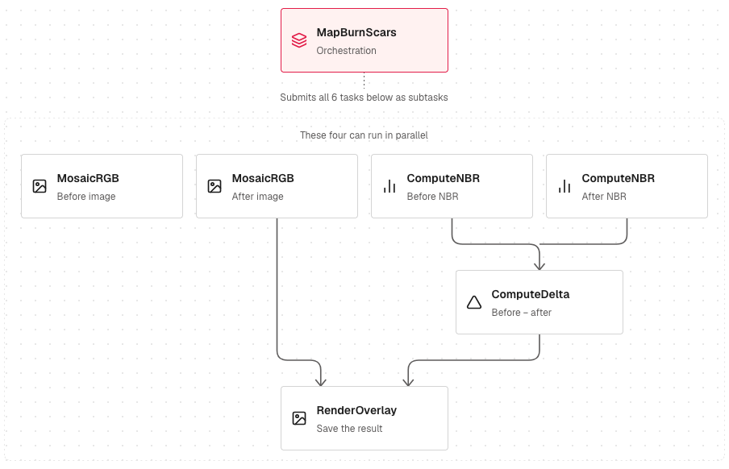

# Burn-scar mapping

The built-out workflow project for the [Build a burn-scar mapping workflow tutorial](https://console.tilebox.com/home/quickstart/build-workflow). Follow the tutorial to build, deploy, and run it step by step.

The workflow compares Sentinel-2 imagery before and after a fire and highlights likely burn scars. This example shows Rhodes after the July 2023 wildfires:


## Submit a job

Once you've completed the tutorial's setup and started your runners, submit the Rhodes example:

```bash
tilebox job submit \
  --name "Rhodes burn-scar example" \
  --task burn-scar-mapping/MapBurnScars \
  --version v1.0 \
  --input '{
    "area": {
      "type": "Polygon",
      "coordinates": [[
        [27.65, 35.85], [28.30, 35.85], [28.30, 36.50],
        [27.65, 36.50], [27.65, 35.85]
      ]]
    },
    "before_time_range": ["2023-07-15T00:00:00Z", "2023-07-20T00:00:00Z"],
    "after_time_range": ["2023-07-25T00:00:00Z", "2023-07-30T00:00:00Z"],
    "dnbr_threshold": 0.27,
    "resolution": 20
  }'
```

Change the polygon and date windows to analyze another area. Inspect progress in Console; the overlay task logs the output PNG's path on the runner's machine.

## Four processing tasks

`MapBurnScars` selects a before and an after date, then orchestrates four task types:

- **`MosaicRGB`** builds a cloud-masked RGB mosaic for each date.
- **`ComputeNBR`** computes the normalized burn ratio (NBR) from near-infrared and shortwave-infrared bands for each date.
- **`ComputeDelta`** subtracts after NBR from before NBR to identify vegetation loss.
- **`RenderOverlay`** highlights pixels above the delta-NBR threshold on the after-date RGB image.

The two RGB and two NBR tasks run in parallel. `ComputeDelta` waits for both NBR results; `RenderOverlay` waits for delta NBR and the after-date RGB.



See the [tutorial](https://console.tilebox.com/home/quickstart/build-workflow) for the implementation walkthrough, caching, and deployment instructions.
