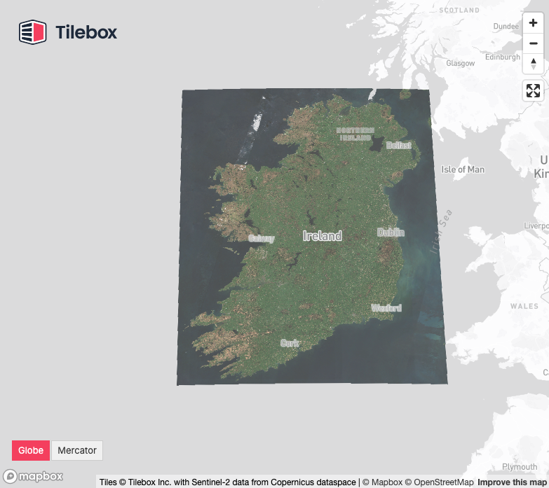

# Sentinel-2 Cloudfree Mosaic Workflow

This workflow reads Sentinel-2 data from the Copernicus archive, and writes a cloudfree mosaic to a Zarr datacube.

<p align="center">
  <a href="https://examples.tilebox.com/sentinel2_mosaic"></a>
</p>

---

## Quickstart

### Prerequisites

1. Shared bucket

Since this workflow can be run in a distributed manner, the output dataset is written into a shared `S3` bucket.
To set this up, create an `S3` bucket, and set the `ZARR_S3_BUCKET` and `ZARR_S3_BUCKET_REGION` variable in
`sentinel2zarr.py` to the name and region of the bucket you want to use.

> [!TIP]  
> You can also use a GCS bucket instead, check out our [docs](https://docs.tilebox.com/workflows/caches#google-storage-cache) for more information. Or if you only run tasks on a single machine, you can use a local filesystem too.

2. Access to the Copernicus archive

To access the Copernicus archive, you need to register at [Copernicus Dataspace](https://dataspace.copernicus.eu) and generate credentials
for their S3 interface using [their S3 key manager](https://eodata-s3keysmanager.dataspace.copernicus.eu/panel/s3-credentials).

Then configure it on your machine by adding a `copernicus-dataspace` profile to your `~/.aws/credentials` file.

```
[copernicus-dataspace]
endpoint_url=https://eodata.dataspace.copernicus.eu
aws_access_key_id=N...
aws_secret_access_key=j...
```


### Starting a runner

1. Copy `.env.example` to `.env`
    - set a `TILEBOX_API_KEY` which you generate via the [Tilebox console](https://console.tilebox.com)
    - set a proper `RUNNER_NAME` to identify this machine in logs and traces
    - to enable observability to [Axiom](https://axiom.co/) specify an `AXIOM_API_KEY`

2. Start a runner

```
uv run sentinel2zarr.py
```

> [!TIP]
> You can easily start multiple runners on one machine in parallel using [call-in-parallel](https://github.com/tilebox/call-in-parallel): `call-in-parallel -n 4 -- uv run sentinel2zarr.py`

### Submitting a job

The runners will idle until you submit a job. To submit a job, use the `WorkflowsClient` from `tilebox-workflows`:

```python
from tilebox_workflows import Client
from sentinel2zarr import Sentinel2ToZarr, RegionOfInterest, AreaOfInterest

aoi = AreaOfInterest(-10.68234795, 51.36473433, -5.34679566, 55.44704815)  # ireland
time_interval = ("2025-03-01", "2025-06-01")  # Spring 2025 season


client = Client()
client.jobs().submit(
    "s2-ireland-mosaic-spring-2025",
    Sentinel2ToZarr(
        collection="S2A_S2MSI2A",
        roi=RegionOfInterest(aoi, time_interval),
        crs="EPSG:2157",
        resolution=10
    ),
)
```

### Check the progress in the Tilebox Console

Head over to the [Jobs](https://console.tilebox.com/workflows/jobs) page in the Tilebox console to check the progress of your submitted job.

## Workflow Architecture

The workflow consists of three steps:

1. Locating all granules that intersect with the given spatial and temporal region of interest
    - Knowing that, we can already determine the shape of the output datacube, since every granule corresponds to
      one time layer in our Zarr cube.
    - Therefore at this point we already initialize an empty cube with the proper dimensions.
2. Reading all granules into the Zarr cube
    - For each granule, we read the 10m bands B02 (blue), B03 (green), B04 (red) and 20m SCL (scene classification layer)
    - We reproject each product to the target `CRS` and resolution
    - And finally write it to the Zarr cube to the corresponding time layer
    - This is done in parallel for all granules and each product in case there are multiple task runners available
3. Computing the cloudfree mosaic
    - For each spatial chunk in the Zarr cube, we compute the cloudfree mosaic across the time dimension
    - By applying the [SCL layer as cloud mask](https://sentiwiki.copernicus.eu/web/s2-processing#S2Processing-ClassificationMaskGeneration), and then computing the [25% quantile among the remaining valid observations](https://documentation.dataspace.copernicus.eu/Data/SentinelMissions/Sentinel2.html#sentinel-2-level-3-quarterly-mosaics)


## Visualization

Interactively visualizing the mosaic from Zarr directly isn't well supported yet, therefore as a final post-processing step we convert the Zarr mosaic to a `GeoTIFF` using `rasterio` and then to a COG using [rio-cogeo](https://github.com/cogeotiff/rio-cogeo), which can then be visualized using e.g. [rio-viz](https://github.com/developmentseed/rio-viz).


