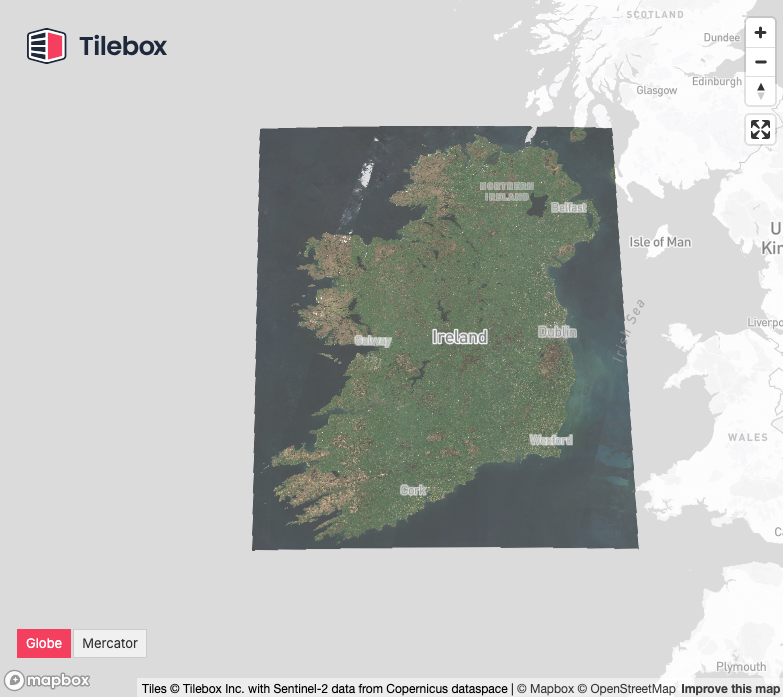

# Sentinel-2 Cloudfree Mosaic Workflow

This workflow queries credentials-free Sentinel-2 L2A COGs from AWS Earth Search and writes a cloud-free RGB mosaic to Zarr.

<p align="center">
  <a href="https://examples.tilebox.com/sentinel2_mosaic"></a>
</p>

---

## Quickstart

### Prerequisites

1. Shared bucket

Since this workflow can be run in a distributed manner, the output dataset and workflow cache are written into a shared bucket.
This example is configured for GCS; set the `ZARR_GCS_BUCKET` and `ZARR_GCS_PROJECT` constants in
`s2_cloudfree_mosaic/tasks.py` to the bucket and project you want to use.

> [!TIP]  
> If you only run tasks on a single machine, you can use a local filesystem cache instead.

### Building and running the workflow

This example is structured as a Tilebox workflow release project:

- `tilebox.workflow.toml` configures the release build and points at `runner:runner`
- `runner.py` exports the reusable `Runner` definition
- `s2_cloudfree_mosaic/tasks.py` contains the workflow tasks

1. Copy `.env.example` to `.env`
    - set a `TILEBOX_API_KEY` which you generate via the [Tilebox console](https://console.tilebox.com)
    - logs and traces are exported to Tilebox automatically by the workflow client

2. Validate the release artifact

```
tilebox workflow build-release --debug --json
```

3. Publish and deploy the release to a cluster

```
tilebox workflow publish-release --json
tilebox workflow deploy-release --latest --cluster <cluster-slug> --json
```

4. Start a release runner for that cluster

```
tilebox runner start --cluster <cluster-slug>
```

For local direct-runner iteration, you can still run the same `Runner` object through the compatibility entrypoint:

```
uv run sentinel2zarr.py --cluster <cluster-slug>
```

### Submitting a job

The release runner will idle until you submit a job. To submit a job, use the `Client` from `tilebox.workflows`:

```python
from datetime import UTC, datetime

from odc.geo import CRS, Geometry, Resolution
from shapely import box
from tilebox.datasets.query import TimeInterval
from tilebox.workflows import Client

from s2_cloudfree_mosaic import BuildMosaic

aoi = Geometry(box(16.15, 48.05, 16.65, 48.37), "EPSG:4326")  # Vienna, Austria
time_interval = TimeInterval(datetime(2025, 5, 5, tzinfo=UTC), datetime(2025, 5, 12, tzinfo=UTC))


client = Client()
client.jobs().submit(
    "s2-vienna-weekly-mosaic",
    BuildMosaic(
        area=aoi,
        time_interval=time_interval,
        output_crs=CRS("EPSG:3857"),
        resolution=Resolution(x=10, y=-10),
        max_cloud_cover=20,
    ),
)
```

### Check the progress in the Tilebox Console

Head over to the [Jobs](https://console.tilebox.com/workflows/jobs) page in the Tilebox console to check the progress of your submitted job.

## Workflow Architecture

The workflow consists of two steps:

1. `BuildMosaic` queries the `open_data.aws_earth.sentinel2` dataset with spatial, temporal, collection, and cloud-cover filters. It builds an exact ODC `GeoBox`, divides it with `GeoboxTiles`, initializes the output, and submits one task per tile.
2. Each `ComputeMosaicTile` task opens only the intersecting COG windows for `red`, `green`, `blue`, and `scl`, reprojects them to its output tile, applies the SCL mask, computes the 25th percentile, and writes its disjoint Zarr region.

No full Sentinel-2 product is downloaded and no intermediate time-series cube is written.


## Visualization

Interactively visualizing the mosaic from Zarr directly isn't well supported yet, therefore as a final post-processing step we convert the Zarr mosaic to a `GeoTIFF` using `rasterio` and then to a COG using [rio-cogeo](https://github.com/cogeotiff/rio-cogeo), which can then be visualized using e.g. [rio-viz](https://github.com/developmentseed/rio-viz).
