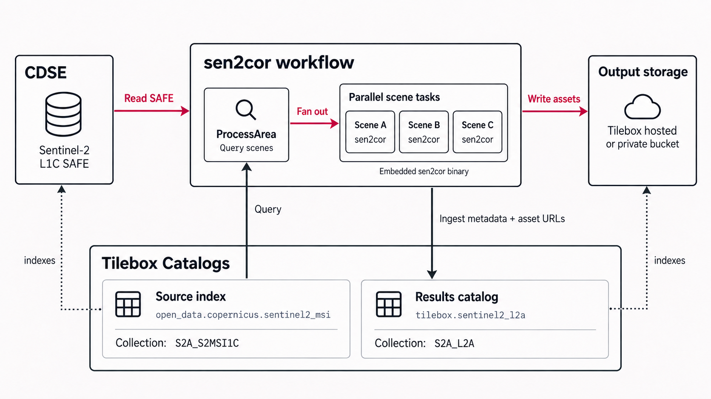

# Scene-parallel atmospheric correction

Wrap the existing Sen2Cor command-line processor in a Tilebox workflow. Tilebox
selects Sentinel-2 L1C scenes, schedules an independent task for each scene, and
provides retries, progress, logs, and tracing. Each scene produces a 20 m L2A SAFE
and a catalog record with a publicly accessible RGB preview.

<picture>
  <source media="(prefers-color-scheme: dark)" srcset="assets/architecture-dark.png">
  
</picture>

Each scene task runs the Sen2Cor binary embedded in the worker image. Output
storage can be Tilebox hosted or a private bucket in this architecture; this demo
uploads only the RGB preview to Tilebox hosted storage. Full SAFE products remain
local, with explicitly marked placeholder bucket URLs in the results catalog.

There is no aggregation barrier: each scene publishes independently. The expected
graph is one root task plus N scene tasks. Each worker runs one task at a time;
start multiple workers on the same cluster to process scenes concurrently.

## Setup

Install Docker and uv. Run commands from this directory. Create a private `.env`
file (`cp .env.example .env`) containing:

```dotenv
TILEBOX_API_KEY=your-api-key
TILEBOX_CLUSTER=cluster-slug, or leave empty for default cluster
CDSE_ACCESS_KEY=your-s3-access-key
CDSE_SECRET_KEY=your-s3-secret-key
```

Get CDSE **S3 keys**, not your account password, from the
[credentials manager](https://eodata-s3keysmanager.dataspace.copernicus.eu/).
The Tilebox key needs access to the source dataset, destination dataset, workflow
cluster, and prototype hosted storage. `TILEBOX_API_URL` optionally selects the
development API; hosted preview URLs use the matching `.com` or `.dev` service.

Install dependencies and manually create the destination catalog:

```bash
uv sync --locked
uv run scripts/catalog.py create --name "sentinel2_l2a" --collection S2A_L2A
```

The schema lives in `atmospheric_correction/catalog.py`. The `create` command
creates or updates it only when explicitly run; the workflow never creates datasets.
Use the actual organization-qualified slug in submission commands below. All Python
CLIs load `.env` automatically without overriding existing environment variables.
Submission uses the default cluster when `TILEBOX_CLUSTER` is unset or empty.

To delete all datapoints from a collection while retaining its schema and files:

```bash
uv run scripts/catalog.py empty --dataset tilebox.sentinel2_l2a --collection S2A_L2A
```

**`empty` deletes immediately and permanently.** Stop jobs ingesting into that
collection before running it.

## Run and observe

For a live demo, [warm the cache](#prepare-a-fast-demo) before starting the worker.
Run both the preparation scripts and the following commands from `s2-sen2cor`.

```bash
docker build --platform linux/amd64 -t s2-sen2cor:local .
mkdir -p outputs
docker run --rm --platform linux/amd64 --env-file .env \
  --workdir /app -v "$PWD/outputs:/app/outputs" s2-sen2cor:local
```

The scripts and worker both resolve `outputs/cache` relative to their working
directory. This bind mount shares the **same files**, with these paths:

| Host (from this directory) | Container |
| --- | --- |
| `$PWD/outputs/cache` | `/app/outputs/cache` |
| `$PWD/outputs/results` | `/app/outputs/results` |

Do not mount `outputs` at `/outputs` or change the container working directory;
the worker would then look in a different cache. No identical host/container
absolute paths are required because catalog previews use HTTPS, not local paths.

On Linux, after warming the cache and before `docker run`, make the mounted tree
writable by the container's UID 10001: `sudo chown -R 10001:10001 outputs`.
This changes ownership of the local demo cache and results. On Docker Desktop,
allow sharing of this directory. Apple Silicon uses amd64 emulation. Correction
is CPU- and memory-intensive: the previous 10 m test peaked around 12 GiB with
one scene at a time; the 20 m version has not yet been benchmarked. Add workers
only when the machine has enough capacity.

In another terminal, submit up to three low-cloud scenes:

```bash
uv run --env-file .env scripts/submit.py \
  --start 2025-08-01 --end 2025-09-01 \
  --bounds 54.2 24.2 54.6 24.6 \
  --source open_data.copernicus.sentinel2_msi S2A_S2MSI1C \
  --destination tilebox.sentinel2_l2a S2A_L2A \
  --max-scenes 3
```

Source and destination are each a `(dataset_slug, collection_name)` tuple. Bounds
are west, south, east, north; end is exclusive. Cloud cover defaults to ≤20% and
is filtered locally because the source catalog does not expose a server-side
cloud filter. Keep the query interval and area small: `max_scenes` limits processing,
not the initial catalog query. Bounds select full tiles; they do not crop imagery.

Open the job in the Tilebox Console to see scene fan-out and progress. Each scene
has `download-l1c`, `sen2cor-20m`, `upload-rgb`, and `ingest-l2a` spans, plus logs
with the source ID, output location, preview URL, and total elapsed time.

## Results and demo storage

- Full L2A products stay under `outputs/results/<job-id>/<source-id>/*.SAFE`.
- A 512-pixel-wide `rgb.png` is generated from Sen2Cor's 20 m TCI and uploaded
  through the same prototype hosted-storage API used by `seasonal-timelapse`.
- The destination dataset retains the acquisition time, footprint, source ID,
  processor/pipeline versions, and canonical `assets` and `storage` fields.
- The `rgb` asset has a real public HTTPS URL and `visual`/`thumbnail` roles.
- Every file inside the generated SAFE has an asset entry keyed by its relative
  path, pointing to **invented** `s3://output-bucket/<product>/<file>` locations.
  Their storage scheme explicitly says these files were not uploaded. Do not
  try to download these placeholder assets; use the local SAFE instead.

Only the RGB preview is uploaded. There is no NDVI, Azure configuration, full-SAFE
upload, or completion-record system. Hosted previews are public; do not upload
sensitive imagery through this demo endpoint.

List preview URLs:

```bash
uv run --env-file .env scripts/query_results.py \
  --start 2025-08-01 --end 2025-09-01 \
  --destination tilebox.sentinel2_l2a S2A_L2A
```

## Prepare a fast demo

The full L1C SAFE is cached under `outputs/cache`. Subsequent downloads reuse
existing files through the storage SDK. First preview the scenes the root task
would select:

```bash
uv run scripts/query_scenes.py \
  --start 2025-08-01 --end 2025-09-01 \
  --bounds 54.2 24.2 54.6 24.6 --max-scenes 3 --max-cloud-cover 20
```

Defaults match the README submission example. Override `--start`, `--end`,
`--bounds`, `--max-scenes`, or `--max-cloud-cover` to match your job; use
`--dataset` and `--collection` to choose its source. The script prints the selected
scene IDs and a ready-to-run download command. It only queries metadata.

Copy and run that command to warm the cache, or supply known IDs directly:

```bash
uv run scripts/download_scenes.py SCENE_ID_1 SCENE_ID_2 \
  --dataset open_data.copernicus.sentinel2_msi --collection S2A_S2MSI1C
```

The command downloads sequentially with a tqdm progress bar and prints IDs,
granule names, and cache paths.

Wait for downloads to finish, then start the Docker worker using the bind mount
above and submit the job with the same dates, bounds, source, and selection limits.
Existing SAFE files will be reused; catalog requests and source file listings
still require network access. This example does not coordinate simultaneous
downloads of the same scene into a shared cache. Separate machines have separate
caches unless you arrange a shared mount.

After the job completes, query the output catalog:

```bash
uv run scripts/query_results.py \
  --start 2025-08-01 --end 2025-09-01 \
  --destination tilebox.sentinel2_l2a S2A_L2A
```

`query_scenes.py` selects **inputs**, `download_scenes.py` warms their cache, and
`query_results.py` prints hosted RGB URLs for **completed outputs**. Querying
results does not warm the L1C cache.

Scene tasks retry twice. A retry reuses input files but replaces that job/scene's
local output and reruns correction. The content-addressed RGB upload and
`ingest(..., allow_existing=True)` permit reuse of identical results; this is not
an exactly-once publication system. Avoid overlapping attempts for the same scene.

Sen2Cor 02.12.04 is pinned in Docker. Processing uses 20 m resolution and explicitly
disables optional 60 m downsampling, otherwise retaining the installed default
configuration (no external DEM or ESA CCI data). Results can differ from official
Copernicus L2A. Native Linux x86_64 users can install the same Sen2Cor release and
run `uv run --env-file .env runner.py` instead of Docker.

## Code and offline checks

```text
atmospheric_correction/
    tasks.py          # selection, scene fan-out, stage spans, ingestion
    processing.py     # Sen2Cor invocation and RGB preview
    catalog.py        # schema, hosted upload, and output asset metadata
scripts/
    catalog.py        # create dataset or empty a collection
    submit.py         # job submission
    query_scenes.py   # preview input selection and print download command
    download_scenes.py # optional multi-scene cache preparation
    query_results.py  # preview URL lookup
tests/
runner.py             # task registration and worker entrypoint
```

All CLIs use Cyclopts and support `--help`.

```bash
uv run pytest -q
uv run ruff check .
uv run ruff format --check .
uv run ty check
```

Tests use synthetic rasters and mock subprocess/API calls. They do not run
Sen2Cor, upload imagery, create datasets, or submit jobs. A manual scene run is
still needed to verify the processor, hosted upload, catalog preview, and actual
task graph together.
