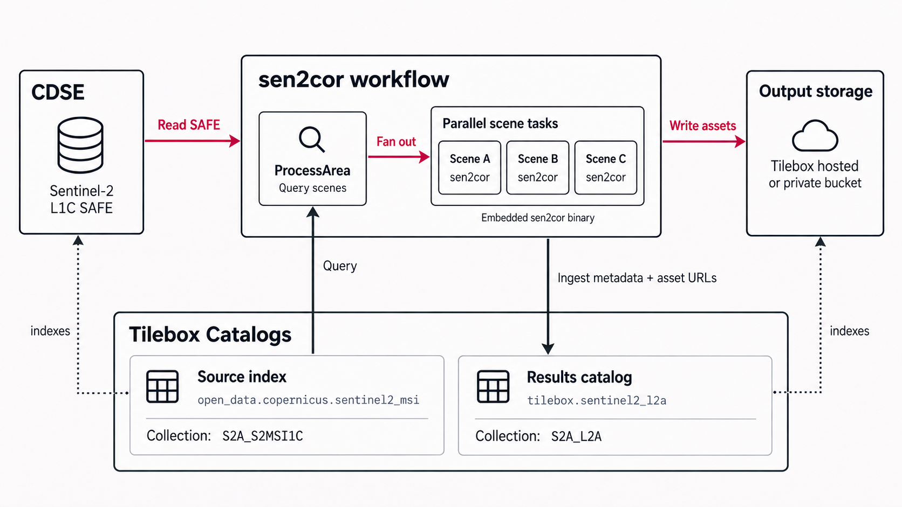

# Sentinel-2 atmospheric correction and NDVI

Query Sentinel-2 L1C imagery, run Sen2Cor locally, and calculate masked 20 m NDVI.
Choose how to connect the stages:

- **[Workflow mode](#workflow-mode):** one task per scene downloads, corrects, calculates NDVI, and
  catalogs an RGB preview. Full products stay local.
- **[Event-driven mode](#event-driven-mode):** a manually submitted job downloads
  and corrects each scene, then uploads the NDVI inputs to Azure. A completion
  marker triggers NDVI, a public PNG preview, and catalog ingestion.

Both modes share the processing functions and Docker image. Workers run locally
or on-prem. The optional [Tilebox IaC](https://github.com/tilebox/tilebox-iac)
program provisions Azure storage, worker credentials, and notifications.

## Setup

Install Docker, uv, Git, and the [Tilebox CLI](https://tilebox.com/docs/cli#installation).
Run commands from `s2-sen2cor` unless stated otherwise.
Copy `.env.example` to `.env` and set:

```dotenv
TILEBOX_API_KEY=your-api-key
TILEBOX_CLUSTER=
CDSE_ACCESS_KEY=your-s3-access-key
CDSE_SECRET_KEY=your-s3-secret-key
```

Get CDSE **S3 keys**, not an account password, from the
[credentials manager](https://eodata-s3keysmanager.dataspace.copernicus.eu/).
The Tilebox key needs source-dataset, destination-dataset, workflow, and cluster access.
In workflow mode, the worker uploads RGB previews to Tilebox storage.
These uploads are currently in private preview; contact Tilebox for access.
In event-driven mode, the worker uploads images to your Azure account instead.

Leave `TILEBOX_CLUSTER` empty to use the **Default** cluster for submission and workers.
CLIs load `.env` without
overriding existing environment variables.

```bash
uv sync --locked
docker build --platform linux/amd64 --tag s2-sen2cor:local .
```

Sen2Cor `02.12.04` requires Linux x86_64;
Apple Silicon uses amd64 emulation. Allow tens of GiB of scratch disk and start
with one worker. An earlier 10 m run used about 12 GiB of memory; this 20 m version
has not been benchmarked.

### Deploy the workflow

Both modes use dynamic release runners. The image contains Sen2Cor and the runner;
Python code and dependencies come from the deployed workflow release.

Run all commands in this section from `s2-sen2cor`, where `.env` and
`tilebox.workflow.toml` are located. Create the workflow once (skip if it already exists):

```bash
uv run --env-file .env tilebox workflow create "Sentinel-2 atmospheric correction"
```

Set `workflow.slug` in `tilebox.workflow.toml` to the returned slug if it differs.
Publish and deploy to the Default cluster:

```bash
uv run --env-file .env tilebox workflow publish-release
uv run --env-file .env tilebox workflow deploy-release --latest
```

Publishing builds and validates the release before uploading it. After Python code
changes, repeat these two commands; running workers pick up the deployment without
an image rebuild. Rebuild the image only when Sen2Cor or system dependencies change.
Deploy before submitting jobs or enabling the NDVI automation. If using a custom
cluster, pass `--cluster` to deployment and set the same `TILEBOX_CLUSTER` in `.env`.

## Workflow mode

<picture>
  <source media="(prefers-color-scheme: dark)" srcset="assets/architecture-dark.png">
  
</picture>

Create the destination catalog, then start the worker:

```bash
uv run scripts/catalog.py create --name sentinel2_l2a --collection S2A_L2A
mkdir -p outputs
# Linux: give the container's UID ownership of the local cache/results directory.
sudo chown -R 10001:10001 outputs
docker run --rm --platform linux/amd64 --env-file .env \
  --workdir /app --volume "$PWD/outputs:/app/outputs" s2-sen2cor:local
```

On Docker Desktop, omit `chown` and allow directory sharing. Keep the mount at
`/app/outputs`: the image sets `S2_OUTPUT_DIRECTORY` to this absolute path so cache
and results stay on the mounted disk across release deployments.

In another terminal, submit a scene. Replace `tilebox.sentinel2_l2a` with the
organization-qualified slug returned by catalog creation:

```bash
uv run scripts/submit.py \
  --start 2025-08-01 --end 2025-09-01 \
  --bounds 1.1 47.2 1.3 47.4 \
  --source open_data.copernicus.sentinel2_msi S2A_S2MSI1C \
  --destination tilebox.sentinel2_l2a S2A_L2A --max-scenes 1
```

The example queries the Loire Valley in France, with farmland and woodland rather
than desert. Bounds are west, south, east, north; the end date is exclusive. Bounds select
whole tiles, not crops. Cloud cover defaults to ≤20% and is filtered locally.
Keep the query small: `max_scenes` limits processing, not the catalog query.

Console shows one root task plus one task per scene, with download, Sen2Cor,
NDVI, preview-upload, and ingestion spans. Tasks retry twice. A retry reuses
cached inputs but reruns correction; avoid overlapping attempts for the same scene.

### Results

Each scene writes its SAFE, `ndvi.tif`, and `rgb.png` to
`outputs/results/<job-id>/<source-id>/`. Only the RGB preview is uploaded.
**Hosted previews are public; do not use sensitive imagery.**

Catalog records contain acquisition metadata and the real preview URL. SAFE
asset URLs under `s3://output-bucket/` are placeholders, not uploaded files.
NDVI remains local and is not cataloged. List preview URLs with:

```bash
uv run scripts/query_results.py \
  --start 2025-08-01 --end 2025-09-01 \
  --destination tilebox.sentinel2_l2a S2A_L2A
```

### Optional download cache

Preview the selection, then run the download command it prints before starting
the worker. Use the same dates, bounds, and limits as your submission:

```bash
uv run scripts/query_scenes.py \
  --start 2025-08-01 --end 2025-09-01 \
  --bounds 1.1 47.2 1.3 47.4 --max-scenes 1
```

Downloads go to `outputs/cache`. On Linux, repeat `chown` afterward so the worker
can write there. Cached runs still need network access for metadata and file
listings. Concurrent downloads into a shared cache are not coordinated.

## Event-driven mode

```diagram
┌──────────────────────────────────────┐
│ Manual job → local / on-prem worker  │
│ Download L1C → Sen2Cor               │
└──────────────────┬───────────────────┘
                   │ Upload NDVI inputs, then .ready
                   ▼
┌──────────────────────────────────────┐
│ Azure Blob Storage · scenes          │
│ v1/l2a/<scene-id>/                   │
│ B04.tif · B8A.tif · SCL.tif          │
│ MTD_MSIL2A.xml                       │
│ v1/l2a/<scene-id>.ready              │
└──────────────────┬───────────────────┘
                   │ .ready → Event Grid → Tilebox
                   ▼
┌──────────────────────────────────────┐
│ NDVI automation · Default cluster    │
│ Local / on-prem worker computes NDVI │
└──────────────────┬───────────────────┘
                   │ Upload results and ingest catalog
                   ▼
┌──────────────────────────────────────┐
│ Azure: v1/ndvi/<scene-id>.tif        │
│ PNG + GeoTIFF URLs → catalog          │
└──────────────────────────────────────┘
```

The 20 m B04, B8A, and SCL bands are uploaded as separate, losslessly DEFLATE-compressed
COGs alongside `MTD_MSIL2A.xml`. Pixel values, georeferencing, and nodata are preserved;
nearest-neighbor overviews preserve SCL classes. Each file has its own blob URL.
L1C and unused L2A bands stay local. The worker also creates a small RGB PNG from
Sen2Cor's true-color image and uploads it to `previews/l2a/<random-uuid>/rgb.png`.
It registers the bands, metadata, and preview in `S2A_L2A`, then writes a `.ready` JSON file containing the source and destination
collections and a random preview UUID. Only that file triggers NDVI as a separate
job; band uploads and results do not match the event filter. The NDVI task downloads
the three COGs and metadata directly, without unpacking an archive.

One Azure storage account contains two containers (Azure's equivalent of buckets):
`scenes` holds private inputs and GeoTIFFs; `previews` allows public reads of PNGs
but not anonymous listing or writes. **Anyone with a preview URL can read it.**
Random UUID paths prevent easy guessing, not sharing; do not use sensitive imagery.

Create the catalog from `s2-sen2cor`:

```bash
uv run scripts/catalog.py create --name sentinel2_l2a --collection S2A_L2A
```

This creates `S2A_L2A` and `S2A_NDVI` in the same dataset. Use `--ndvi-collection`
on both catalog creation and job submission if you want a different NDVI collection name.

### 1. Provision Azure storage

Install [Pulumi](https://www.pulumi.com/docs/install/),
[Git](https://git-scm.com/downloads), and
[Azure CLI](https://learn.microsoft.com/en-us/cli/azure/install-azure-cli).
Your deployment identity needs permission to
create a resource group, storage account, Event Grid subscription, and role
assignments, plus register applications in Microsoft Entra ID. Ask your Azure
administrator if application registration is restricted.
[Register the resource providers](https://learn.microsoft.com/en-us/azure/azure-resource-manager/management/resource-providers-and-types#register-resource-provider)
`Microsoft.Storage` and `Microsoft.EventGrid` if needed.

Run from `s2-sen2cor/infrastructure`:

```bash
az login
az account show --query '{name:name, id:id}'
```

Use the tenant and subscription selected at login. Only run
`az account set --subscription YOUR_SUBSCRIPTION_ID` if you need to switch.

Pulumi creates the worker's application identity (service principal) and client
secret, then grants it read/write access to the two containers. No manual identity
setup or ID lookup is needed.

```bash
uv sync --locked
pulumi login --local
pulumi stack init dev
pulumi config set azure:subscriptionId "$(az account show --query id --output tsv)"
pulumi up
pulumi stack output
```

Pulumi uses the active Azure subscription and defaults to `westeurope`. Set
`pulumi config set location REGION` only if you need another region. Tilebox uses
the Default cluster. Shared Key access is disabled.

**State stays local in `~/.pulumi`; no Pulumi Cloud account is required.** Keep that
directory, `Pulumi.dev.yaml`, and the stack's encryption passphrase for later
updates and teardown. Back them up securely; do not commit credentials or state.

### 2. Connect storage notifications and register the NDVI automation

The first `pulumi up` creates storage and the worker identity, but no Event Grid
subscription yet. Two subscriptions are needed: one in Tilebox to receive events,
and one in Azure Event Grid to send them. **No IaC code changes are needed.**
The steps below follow the [storage connection guide](https://tilebox.com/docs/guides/operations/connect-storage#azure),
with Pulumi handling the Azure configuration.

1. In [Console](https://console.tilebox.com), open **Workflows → Storage → Connect bucket**.
   Select Azure Blob Storage, give the location a name, and enter the
   `storageAccountResourceId` and `container` outputs from `pulumi stack output`.
   Save the location.
2. Open that location and choose **Subscriptions → Add subscription**.
   This creates the **Tilebox subscription**, not the Azure Event Grid subscription.
   Save its endpoint and one-time webhook secret before leaving the page;
   these are not Pulumi outputs.
3. From the infrastructure directory, configure delivery to that endpoint:

```bash
pulumi config set webhookEndpoint 'ENDPOINT_COPIED_FROM_CONSOLE'
pulumi config set --secret webhookSecret
pulumi up
```

Enter the secret at the prompt. This second `pulumi up` creates the **Azure Event
Grid subscription** on the storage account, filtered to `scenes/v1/l2a/*.ready`.
It configures Event Grid Schema, `BlobCreated`, and the secret
`X-Tilebox-Webhook-Secret` header. Tilebox handles webhook validation; no separate
Azure Portal setup is needed.

Then open **Workflows → Automations** and create a
[storage-event automation](https://tilebox.com/docs/guides/operations/configure-storage-event-automations):

| Field | Value |
| --- | --- |
| Name / task display | Calculate NDVI |
| Task identifier | `tilebox.com/examples/s2-events/ndvi` |
| Task version | `v1.0` |
| Task input | `{}` |
| Storage location / glob | Registered container / `v1/l2a/*.ready` |
| Cluster | Default |
| Maximum retries | `2` |

The deployed release provides this task. Complete release deployment, notification
setup, and automation registration before uploading scenes; existing blobs do not
trigger new jobs. After submitting correction below, check the storage location's
**Event history** for the `.ready` event and its linked NDVI job.

### 3. Start the worker and submit correction

From `infrastructure`, append the generated Azure settings to your existing `.env`.
If you left the stack passphrase empty:

```bash
chmod 600 ../.env
PULUMI_CONFIG_PASSPHRASE='' pulumi stack output workerEnvironment --show-secrets >> ../.env
```

If you set a passphrase, supply it through `PULUMI_CONFIG_PASSPHRASE_FILE` and omit
`PULUMI_CONFIG_PASSPHRASE=''`. An empty passphrase does not protect secrets from
anyone who can read your local state; keep `~/.pulumi` private.

Run this once; when credentials change, replace the previous Azure settings.
The output contains a client secret: keep `.env` private. Pulumi encrypts it in
state and hides it from normal output. Both Docker and native workers use these
credentials through `DefaultAzureCredential`.

From `s2-sen2cor`, start the worker:

```bash
docker run --rm --platform linux/amd64 --env-file .env s2-sen2cor:local
```

Alternatively, native Linux x86_64 users with Sen2Cor installed can run
the release runner with an absolute output directory:

```bash
S2_OUTPUT_DIRECTORY="$PWD/outputs" uv run --env-file .env tilebox runner start
```

Workers need outbound access to Tilebox, package registries, GitHub,
Copernicus, Azure Blob Storage, and Entra ID; no inbound webhook port is needed.

In another terminal, use the organization-qualified dataset slug returned by catalog creation:

```bash
uv run scripts/submit.py --event-driven --max-scenes 1 \
  --destination YOUR_ORG.sentinel2_l2a S2A_L2A \
  --start 2025-08-01 --end 2025-09-01 --bounds 1.1 47.2 1.3 47.4
```

Follow the correction and NDVI jobs in Console. In the destination dataset,
`S2A_L2A` contains the corrected bands, metadata, and RGB preview; `S2A_NDVI` contains the NDVI
GeoTIFF and PNG preview. Both records use the scene's acquisition time and footprint,
not the processing date. Both collections have public PNG thumbnails; band and
GeoTIFF URLs require Azure authentication.

The NDVI task uploads a private
GeoTIFF and a public PNG at `previews/ndvi/<random-uuid>/preview.png`, then ingests
its record into `S2A_NDVI`.
The PNG has `visual` and `thumbnail` roles; the GeoTIFF URL still requires Azure
authentication. Worker scratch files are deleted after each task.

To download a result, use Azure CLI signed in as an identity with blob-read access
to `scenes` (the worker role includes this). From `infrastructure`:

```bash
az storage blob download --auth-mode login \
  --account-name "$(pulumi stack output storageAccount)" \
  --container-name "$(pulumi stack output container)" \
  --name 'v1/ndvi/SCENE_ID.tif' --file ndvi.tif
```

Replace `SCENE_ID` with the source scene ID shown in the job logs.

Uploads never overwrite existing blobs. Retries skip completed outputs, although
concurrent attempts can repeat computation. Re-submitting a completed scene emits
no new event; retry failed NDVI jobs in Console. Do not overwrite published inputs.
Retries reuse the preview UUID from the marker and retry catalog ingestion even
when both images already exist. The first submission fixes the destination for
that scene; re-submitting it with a different destination does not redirect it.

### Tear down Azure resources

Stop the worker and remove the Tilebox automation before teardown. From
`s2-sen2cor/infrastructure`, select this example's local stack:

```bash
pulumi login --local
pulumi stack select dev
pulumi state unprotect --all
pulumi destroy
```

**This deletes the storage account and all products and versions.** Review the
destroy preview before confirming. The unprotect step is required because the
example protects storage against accidental deletion.

A successful destroy removes all Azure resources managed by this stack, including
Event Grid, storage, worker role assignments, application identity, and client secret.
It stops their ongoing resource charges; usage already incurred remains billable.
It does not remove your local worker or manually created Tilebox registrations. Remove the storage
subscription and location in Console afterward. Optionally run `pulumi stack remove`
to remove the empty stack; keep state until destruction has succeeded.

## Processing details

Sen2Cor runs at 20 m without optional 60 m export, an external DEM, or ESA CCI data.
Results can differ from official Copernicus L2A.

NDVI uses B04 and narrow-NIR B8A, with BOA offsets and quantification from L2A
metadata. This differs from the 10 m B04/B08 variant. Only SCL classes 4, 5, and 6
(vegetation, bare soil, water) are retained. Missing DN, negative reflectance,
zero denominators, and other SCL classes become nodata (`-9999`). Output is a
float32 Cloud Optimized GeoTIFF.

The PNG preview is at most 512 pixels wide, with transparent nodata and a fixed
blue (−1), tan (0), green (+1) scale. Desert scenes can look uniformly tan; the
example region includes vegetation to make NDVI differences easier to see. Colors
are not stretched per scene, so the same NDVI value keeps the same color.
Use the GeoTIFF for numeric analysis.
